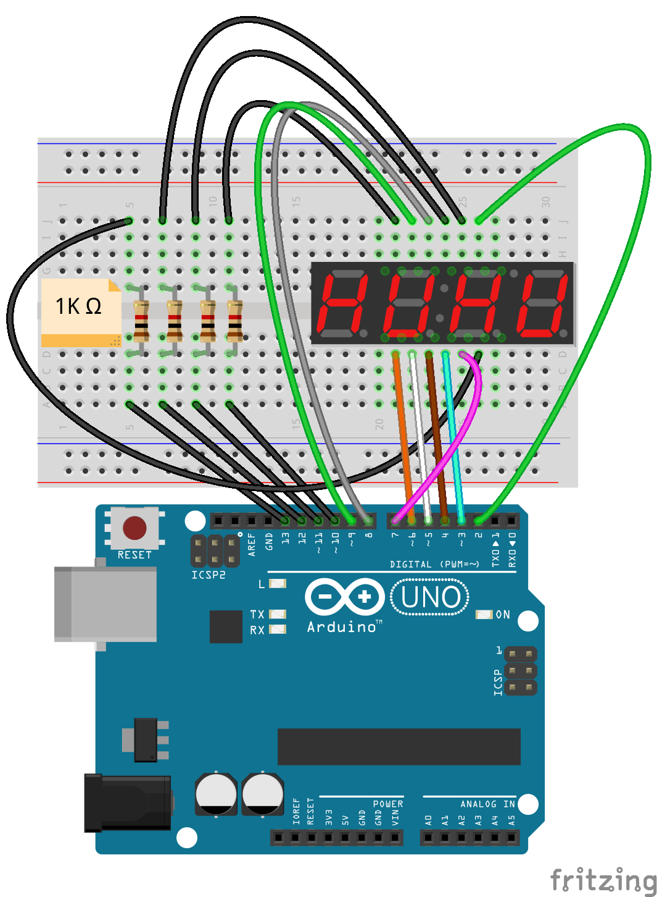

# 4-Digit 7 Segment LED Display

## Preparations

> HARDWARE

- 1x - UNO Board + USB Cable
- 1x - Protoboard
- 1x - 4-Digit 7 Segment LED Display
- 4x - 1K Resistors
- Jumpers

> SOFTWARE

- [SevSeg Repository](https://github.com/DeanIsMe/SevSeg)
