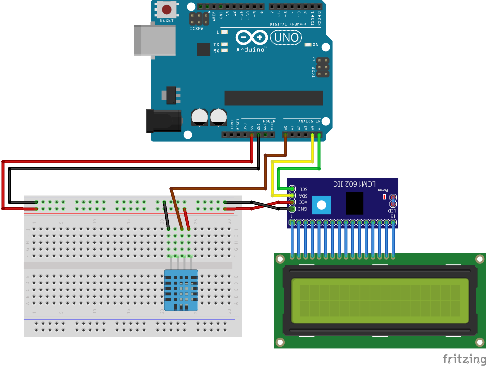

# DHT11 com LiquidCrystal I2C

1. Para controlar o módulo I2C, utilize a biblioteca New LiquidCrystal:

- [Repositório New LiquidCrystal](https://bitbucket.org/fmalpartida/new-liquidcrystal/wiki/Home)

2. Para controlar o sensor DHT, utilize a biblioteca DHT-sensor-library:

- [Repositório DHT-sensor-library](https://github.com/adafruit/DHT-sensor-library)
