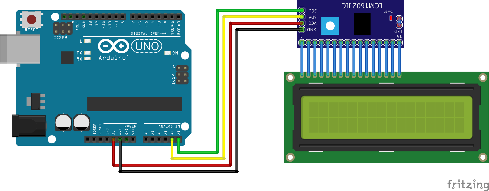

# LiquidCrystal I2C

## Preparations

> HARDWARE

- 1x - UNO Board + USB Cable
- 1x - LiquidCrystal 16x2 + I2C Module
- Jumpers

> SOFTWARE

- [New LiquidCrystal Repository](https://bitbucket.org/fmalpartida/new-liquidcrystal/wiki/Home)
